# Sundy

## Loss Function

Loss function is an important part in artificial neural networks, which is used to measure the inconsistency between predicted value (y^y^) and actual label (yy). It is a non-negative value, where the robustness of model increases along with the decrease of the value of loss function. Loss function is the hard core of empirical risk function as well as a significant component of structural risk function. Generally, the structural risk function of a model is consist of empirical risk term and regularization term, which can be represented as
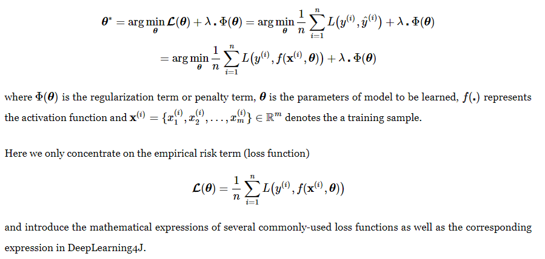

损失函数在深度学习中是必不可少的，那么就有人问损失函数是做什么的，有什么用途了？
  
损失函数用来指引神经网络的训练过程。 The loss function is used to guide the training process of a neural network

a. 对于分类问题， Mean Squared Error(L2 Loss)和 cross entropy loss(交叉熵损失函数）最常用。
b. 对于回归问题， L1 Loss最常用。
c. 对于目标检测问题，常用focal loss
d. 在MASK-RCNN中， average binary cross entropy 。 

### 1. Mean Squared Error(均方误差,quadratic)

**公式**:

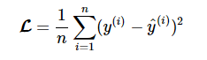  
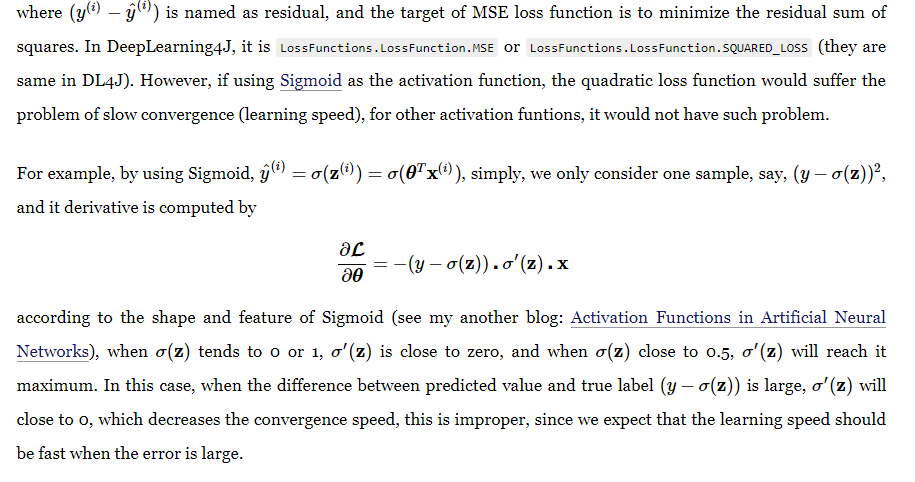  

### 2. Mean Squared Logarithmic Error（MSLE)

**MSLE是MSE的一种变种，公式如下**:

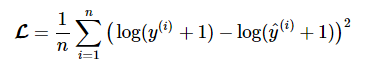
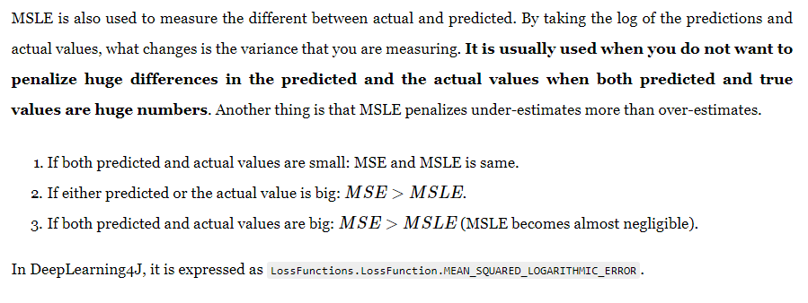

### 3. L2 Loss

L2 Loss的公式和MSE很像，唯一的区别就是不用求和之后不用除以n， 如下所示:

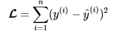

### 4. Mean Absolute Error (MAE)

平均绝对误差用来衡量预测和结果之间的相似度。 
公式如下:

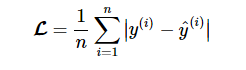

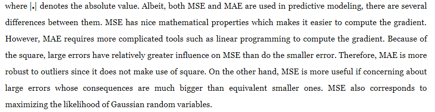

### 5. Mean Absolute Percentage Error(MAPE)
MAPE是MAE的变种, 公式如下:

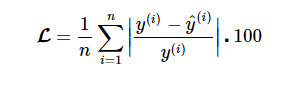

### 6. L1 loss Function

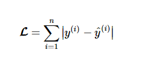

### 7. Kullback Leibler (KL) Divergence

KL Divergence, also known as relative entropy, information divergence/gain, is a measure of how one probability distribution diverges from a second expected probability distribution. KL divergence loss function is computed by

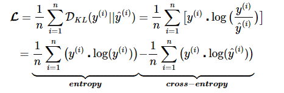
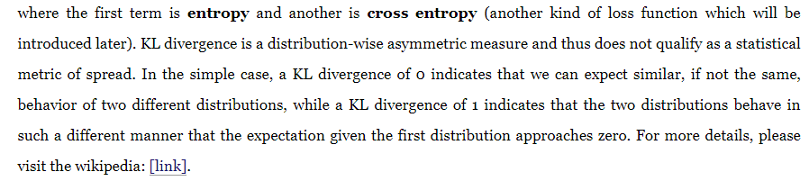

### 8. Cross Entropy(交叉熵)

交叉熵常用于二分类中， 在多分类中常用多类交叉熵。

交叉熵公式如下:

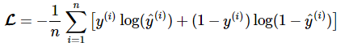
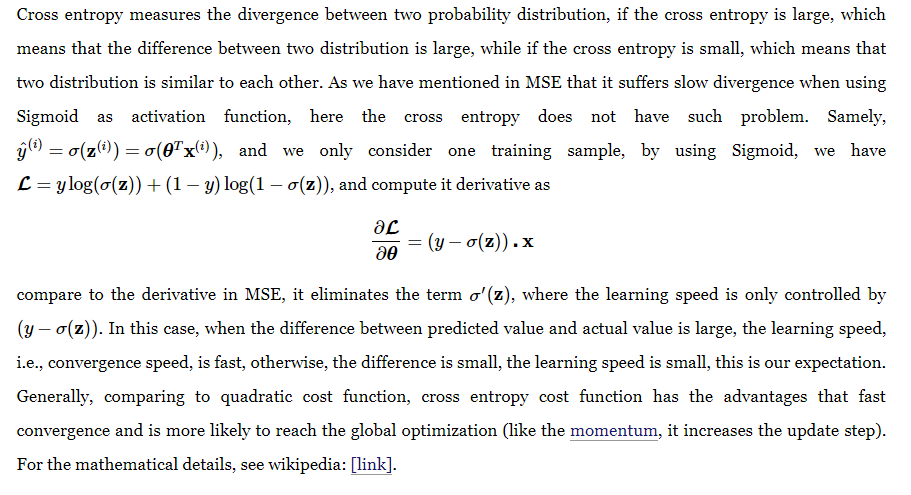

### 9. Negative Logarithmic Likelihood

Negative Log Likelihood loss function is widely used in neural networks, it measures the accuracy of a classifier. It is used when the model outputs a probability for each class, rather than just the most likely class. It is a “soft” measurement of accuracy that incorporates the idea of probabilistic confidence. It is intimately tied to information theory. And it is similar to cross entropy (in binary classification) or multi-class cross entropy (in multi-classification) mathematically. Negative log likelihood is computed by

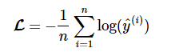

### 10. Poisson

Poisson loss function is a measure of how the predicted distribution diverges from the expected distribution, the poisson as loss function is a variant from Poisson Distribution, where the poisson distribution is widely used for modeling count data. It can be shown to be the limiting distribution for a normal approximation to a binomial where the number of trials goes to infinity and the probability goes to zero and both happen at such a rate that np is equal to some mean frequency for the process. In DL4J, the poisson loss function is computed by

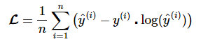

### 11. Cosine Proximity

Cosine Proximity loss function computes the cosine proximity between predicted value and actual value, which is defined as

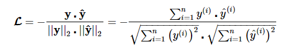

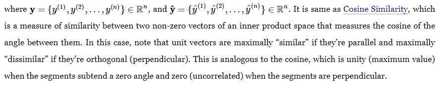

### 12. Hinge 

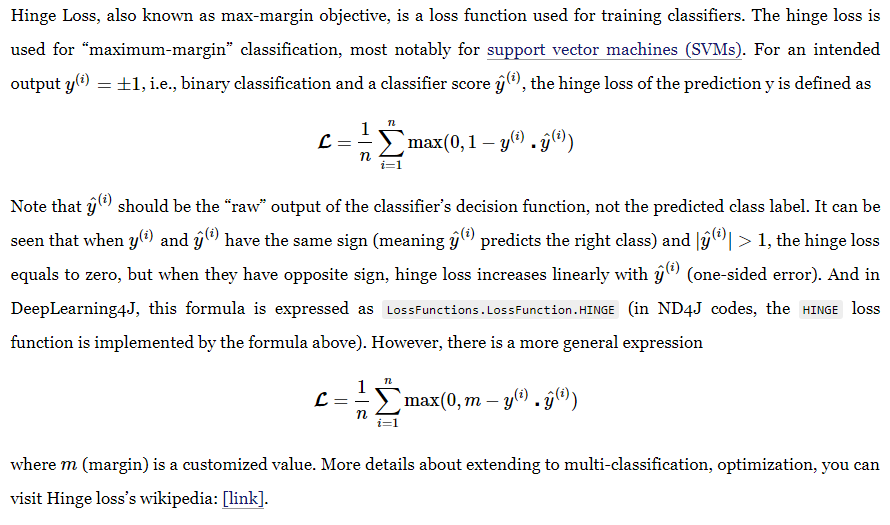

### 13. Squared Hinge
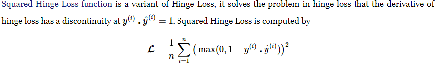

**Reference**

1.[https://isaacchanghau.github.io/2017/06/07/Loss-Functions-in-Artificial-Neural-Networks/](https://isaacchanghau.github.io/2017/06/07/Loss-Functions-in-Artificial-Neural-Networks/)